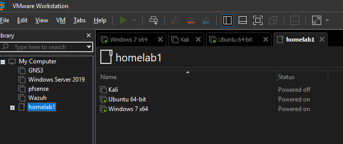
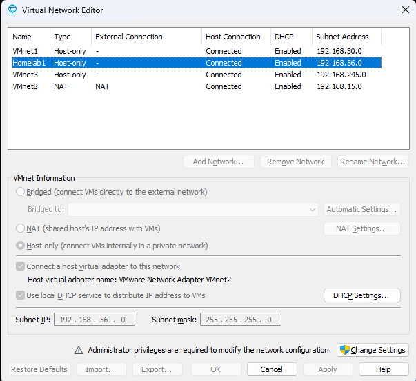
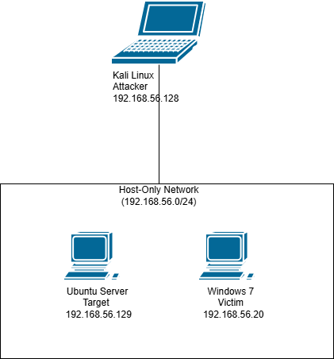
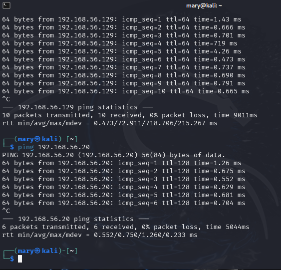
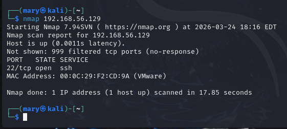
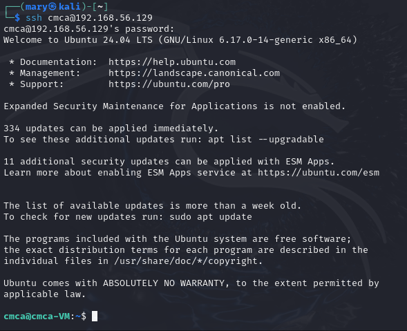
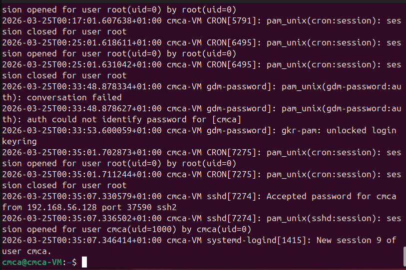

````markdown
# 🔐 Cybersecurity Home Lab (SOC Practice Environment)

## 📌 Overview
This project demonstrates the design and implementation of a personal cybersecurity home lab using virtualization technologies. The lab simulates a small, isolated network environment where both offensive and defensive security techniques can be practiced safely.

The objective is to build practical, hands-on skills aligned with a SOC Analyst role, including network scanning, system configuration, troubleshooting, and basic attack simulation.

---

## 🧱 Lab Architecture

The lab consists of three virtual machines connected through a private Host-Only network:

| Machine        | Role            | IP Address        |
|----------------|-----------------|-------------------|
| Kali Linux     | Attacker        | 192.168.56.128    |
| Ubuntu Server  | Target Server   | 192.168.56.129    |
| Windows 7      | Victim Machine  | 192.168.56.20     |

All systems communicate within the subnet: **192.168.56.0/24**

---

## 🖥️ Technologies Used

- **Virtualization:** VirtualBox / VMware Workstation Player  
- **Operating Systems:**
  - Kali Linux (Attacker)
  - Ubuntu Server (Target)
  - Windows 7 (Victim)
- **Tools & Utilities:**
  - Nmap (Network Scanning)
  - SSH (Remote Access)
  - Windows Event Viewer (Log Analysis)

---

## 🌐 Network Configuration

A **Host-Only Adapter** was used to create an isolated internal network.

- Subnet: `192.168.56.0/24`
- Static IP addresses were manually assigned
- Connectivity verified using ICMP (ping)

### ⚠️ Note on Windows 7 Connectivity

By default, Windows 7 blocks ICMP echo requests (ping).  
To allow communication:

- Inbound firewall rules were modified to enable ICMPv4 Echo Requests

**Steps:**
1. Open *Windows Firewall with Advanced Security*
2. Navigate to **Inbound Rules**
3. Enable:
   - *File and Printer Sharing (Echo Request - ICMPv4-In)*

After applying this change, all machines were able to communicate successfully.

---

## 🛠️ Setup Process

### 1. Virtual Machine Deployment
- Installed virtualization software
- Created and configured 3 virtual machines
- Allocated system resources (RAM, CPU, disk)
- Installed respective operating systems

### 2. Network Setup
- Configured all VMs to use Host-Only Adapter
- Assigned static IP addresses

### 3. Connectivity Testing
- Verified communication between machines using:

```bash
ping 192.168.56.129
ping 192.168.56.20
````

---

## ⚔️ Attack Simulation

### 🔍 Nmap Scan

The Kali Linux machine was used to scan the Ubuntu Server:

```bash
nmap -sV 192.168.56.129
```

### 🎯 Objective

Identify open ports and running services on the target system.

### 📊 Results

* **Port 22 (SSH)** detected as open
* Service version detection confirmed an active SSH service

---

### 🔐 SSH Access

After identifying an open SSH port on the Ubuntu server, a remote connection was established from the Kali Linux machine:

```bash
ssh cmca@192.168.56.129

```

After establishing SSH access, logs were analyzed on the Ubuntu server to monitor authentication activity:

```bash
cat /var/log/auth.log

```
The logs show successful SSH login activity from the Kali Linux machine, confirming that the remote access attempt was recorded by the system.

## 📸 Screenshots

### 🧩 Lab Setup




### 🌐 Network Diagram



### 🔗 Connectivity Test



### 🔍 Nmap Scan Results



### ssh access



### Logs


---

## 🧠 Skills Gained

* Virtual machine deployment and management
* Network configuration and troubleshooting
* Firewall rule analysis and modification
* Basic penetration testing techniques
* Service enumeration using Nmap
* Understanding attacker vs. target interaction
* Log analysis fundamentals

---

## 🚀 Future Improvements

* Integrate SIEM solution (e.g., Wazuh)
* Simulate brute-force and credential attacks
* Implement firewall hardening strategies
* Add intrusion detection systems (IDS)
* Expand to an Active Directory lab

---

## 📚 Key Takeaways

This project highlights the importance of both technical setup and troubleshooting in cybersecurity. Beyond basic configuration, resolving real-world issues—such as firewall restrictions—provides deeper insight into how systems behave in a networked environment.

It also demonstrates the ability to build, manage, and analyze a controlled lab environment similar to enterprise infrastructures.

---

## 📎 Author

**Name:** Chick Mary
**Field:** Cybersecurity
**Focus:** SOC Analysis | Threat Detection | Network Security

